<!-- Generated by GitHub Profile Agent Console. Edit profile.config.json, then run npm run generate. -->

  <picture>
    <source media="(max-width: 760px) and (prefers-color-scheme: dark)" srcset="./assets/hero/agent-console-30415ee7-mobile-dark.svg">
    <source media="(max-width: 760px)" srcset="./assets/hero/agent-console-30415ee7-mobile-light.svg">
    <source media="(prefers-color-scheme: dark)" srcset="./assets/hero/agent-console-30415ee7-dark.svg">
    <source media="(prefers-color-scheme: light)" srcset="./assets/hero/agent-console-30415ee7-light.svg">
    
  </picture>

  

## About Me

I build AI software and modern digital systems.

My work focuses on Anlytix AI and digital legacy platforms.

## Current Focus

| Area | What I am exploring |
| --- | --- |
| **AI Agents** | Building autonomous systems for reasoning, planning, and tool use. |
| **Financial Analytics** | Building AI analytics for global financial markets. |
| **Enterprise Software** | Building scalable and secure enterprise applications. |

## Featured Work

| Project | Focus | Why it matters |
| --- | --- | --- |
| [**Analisis-Asset**](https://github.com/rafaelhugovivaldi19-star/Analisis-Asset) | AI Analytics | AI analytics for financial data and autonomous workflows. |
| [**Anlytix AI**](https://github.com/rafaelhugovivaldi19-star/Anlytix) | Financial AI | AI-powered analytics for global financial markets. |

## Research Direction

I build AI systems, autonomous agents, analytics, and secure digital infrastructure.

## Tech Stack

`JavaScript` · `TypeScript` · `HTML5` · `CSS3` · `Python` · `Laravel` · `PHP` · `Node.js` · `REST API` · `SQL` · `Git` · `Docker` · `AI Agents`

## Recent Activity

<!-- AUTO:ACTIVITY:START -->
- Jul 27, 2026: pushed 1 commit to [rafaelhugovivaldi19-star/rafaelhugovivaldi19-star](https://github.com/rafaelhugovivaldi19-star/rafaelhugovivaldi19-star).
- Jul 27, 2026: created a branch in [rafaelhugovivaldi19-star/rafaelhugovivaldi19-star](https://github.com/rafaelhugovivaldi19-star/rafaelhugovivaldi19-star).
- Jul 18, 2026: created a branch in [rafaelhugovivaldi19-star/Anlytix](https://github.com/rafaelhugovivaldi19-star/Anlytix).
- Jul 14, 2026: created a branch in [rafaelhugovivaldi19-star/Analisis-Asset](https://github.com/rafaelhugovivaldi19-star/Analisis-Asset).
- Jul 10, 2026: created a branch in [rafaelhugovivaldi19-star/SIS---SISTEM-INFORMASI-SEKOLAH-](https://github.com/rafaelhugovivaldi19-star/SIS---SISTEM-INFORMASI-SEKOLAH-).
<!-- AUTO:ACTIVITY:END -->

---

  Building AI systems and digital infrastructure.

