<!-- Generated by GitHub Profile Agent Console. Edit profile.config.json, then run npm run generate. -->

  <picture>
    <source media="(max-width: 760px) and (prefers-color-scheme: dark)" srcset="./assets/hero/agent-console-220626cd-mobile-dark.svg">
    <source media="(max-width: 760px)" srcset="./assets/hero/agent-console-220626cd-mobile-light.svg">
    <source media="(prefers-color-scheme: dark)" srcset="./assets/hero/agent-console-220626cd-dark.svg">
    <source media="(prefers-color-scheme: light)" srcset="./assets/hero/agent-console-220626cd-light.svg">
    
  </picture>

  

  
  
  

## AI Command Center — Live

  <picture>
    <source media="(prefers-color-scheme: dark)" srcset="./assets/cyber/ai-command-center-dark.svg">
    <source media="(prefers-color-scheme: light)" srcset="./assets/cyber/ai-command-center-light.svg">
    
  </picture>

Radar sweep, terminal boot sequence, gauge telemetry, and network map all animate natively via SVG/SMIL — no external scripts required, so it renders the same way GitHub displays it to every visitor.

## Profile Console — About, Focus, Work, Research & Stack

  <picture>
    <source media="(prefers-color-scheme: dark)" srcset="./assets/profile/profile-dark.svg">
    <source media="(prefers-color-scheme: light)" srcset="./assets/profile/profile-light.svg">
    
  </picture>

Typed-terminal "About Me" and "Research Direction" blocks, glowing focus-area cards, animated project cards, and pulsing tech-stack chips — all native SVG/SMIL, themed to match the AI Command Center above. Edit <code>profile.config.json</code>, then run <code>npm run profile-panels</code> (or let the <code>profile-panels.yml</code> workflow keep it in sync).

Open a featured project directly:

<!-- AUTO:PROJECT_LINKS:START -->

  
  

<!-- AUTO:PROJECT_LINKS:END -->

## GitHub Stats

  <picture>
    <source media="(prefers-color-scheme: dark)" srcset="./assets/dashboard/dashboard-dark.svg">
    <source media="(prefers-color-scheme: light)" srcset="./assets/dashboard/dashboard-light.svg">
    
  </picture>

Live repository, language, and contribution data — regenerated automatically. Run <code>npm run dashboard</code> locally, or let the <code>dashboard.yml</code> workflow keep it in sync.

## Contribution Pulse

  <picture>
    <source media="(prefers-color-scheme: dark)" srcset="./assets/pulse/pulse-dark.svg">
    <source media="(prefers-color-scheme: light)" srcset="./assets/pulse/pulse-light.svg">
    
  </picture>

An original animated wave (not GitHub's calendar grid) built from the same contribution data. Run <code>npm run pulse</code> locally, or let the <code>contribution-pulse.yml</code> workflow keep it in sync.

## GitHub Metrics — AI Developer Intelligence Dashboard

  <picture>
    <source media="(prefers-color-scheme: dark)" srcset="./assets/ai-metrics/ai-metrics-dark.svg">
    <source media="(prefers-color-scheme: light)" srcset="./assets/ai-metrics/ai-metrics-light.svg">
    
  </picture>

A fully custom AI command-center panel — animated identity console, digital stat counters, a radar-style skill network, a neon contribution-energy matrix, a commit activity signal chart, a live activity feed, and system telemetry gauges. Built entirely from native SVG/SMIL, no default metrics template involved. Run <code>npm run ai-metrics</code> locally, or let the <code>ai-metrics.yml</code> workflow keep it in sync.

## Recent Activity

  <picture>
    <source media="(prefers-color-scheme: dark)" srcset="./assets/activity/activity-dark.svg">
    <source media="(prefers-color-scheme: light)" srcset="./assets/activity/activity-light.svg">
    
  </picture>

A live-feed terminal panel — animated status dots, tagged event types, and staggered row reveals — themed to match the rest of the console. Run <code>npm run activity</code> locally, or let the <code>update-activity.yml</code> workflow keep it in sync.

View as text (with clickable links)

<!-- AUTO:ACTIVITY:START -->
- Jul 30, 2026: pushed 1 commit to [Tan-Rafael/Tan-rafael](https://github.com/Tan-Rafael/Tan-rafael).
- Jul 29, 2026: pushed 1 commit to [Tan-Rafael/Tan-rafael](https://github.com/Tan-Rafael/Tan-rafael).
- Jul 29, 2026: created a branch in [Tan-Rafael/Tan-rafael](https://github.com/Tan-Rafael/Tan-rafael).
- Jul 28, 2026: pushed 1 commit to [Tan-Rafael/Tan-rafael](https://github.com/Tan-Rafael/Tan-rafael).
- Jul 28, 2026: created a branch in [Tan-Rafael/Tan-rafael](https://github.com/Tan-Rafael/Tan-rafael).
- Jul 18, 2026: created a branch in [Tan-Rafael/Anlytix](https://github.com/Tan-Rafael/Anlytix).
<!-- AUTO:ACTIVITY:END -->

---

  <picture>
    <source media="(prefers-color-scheme: dark)" srcset="./assets/footer/footer-wave-dark.svg">
    <source media="(prefers-color-scheme: light)" srcset="./assets/footer/footer-wave-light.svg">
    
  </picture>

  Building AI systems and digital infrastructure.

